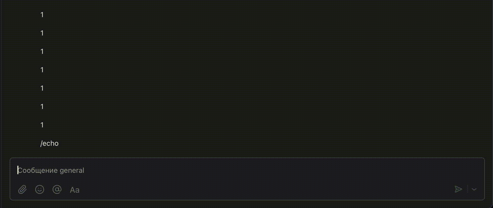

# PachcaHandlers

Base project for creating simple bots or short commands for Pachca messenger

## Configuration

Set `PACHCA_API_KEY` in `.env`\
Migrate db `rake db:migrate`\
Or check `Dockerfile`

## Adding handlers

User-defined handlers go to `app/handlers`. LLM tools (optional) go to `app/tools`.

## Assistant profiles (optional)

The `/ask` command runs the assistant. You can add additional assistant commands by creating more handlers with `assistant true` and configuring:

- `system_prompt` / `system_prompt_i18n` (the assistant instructions)
- `tools` (allowlist of tool class names, e.g. `BrowseWeb`, `CloseSession`). If omitted, assistant handlers default to `CloseSession` only.

Examples:

- `/ask hello`
- `/research summarize https://example.com`

```ruby
class EchoHandler < PachcaHandlers::Handlers::BaseHandler
  title 'Echo'
  command 'echo'

  step :echo do
    intro 'This is a sample handler that echoes back the message you send in the chat.'
    field :message do
      name 'Message'
      description 'The message to echo back'
      validations [
        ->(value) { [!value.empty?, 'Message cannot be empty'] },
        ->(value) { [value.length <= 3, 'Message cannot be longer than 3 characters'] }
      ]
      callback { |ctx| PachcaHandlers::Result.success("Echo: #{ctx[:value]}") }
    end
  end
end
```


